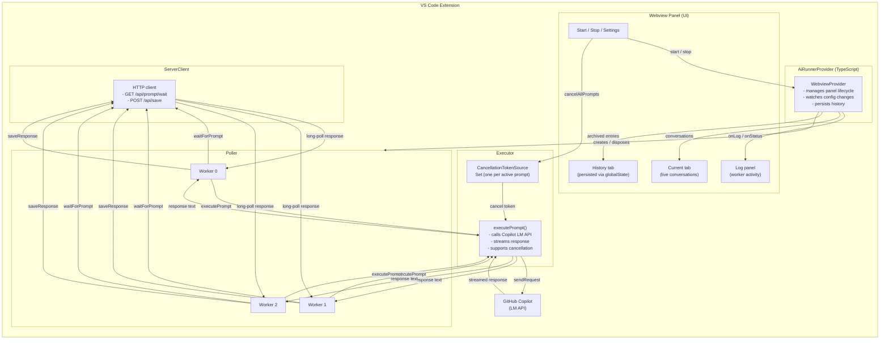
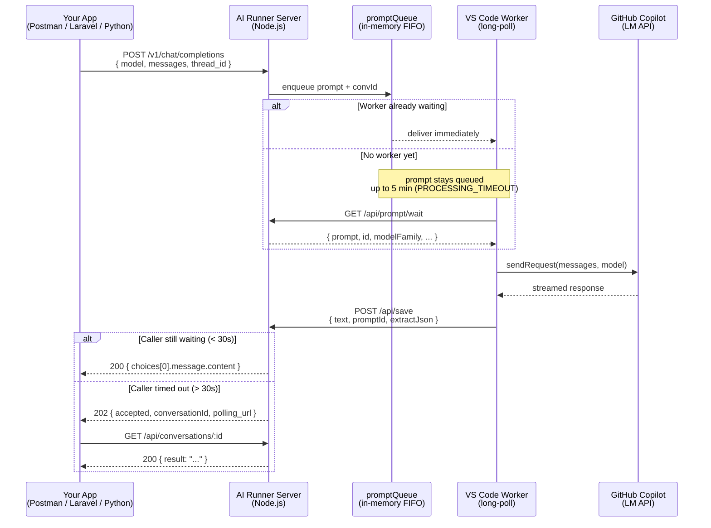
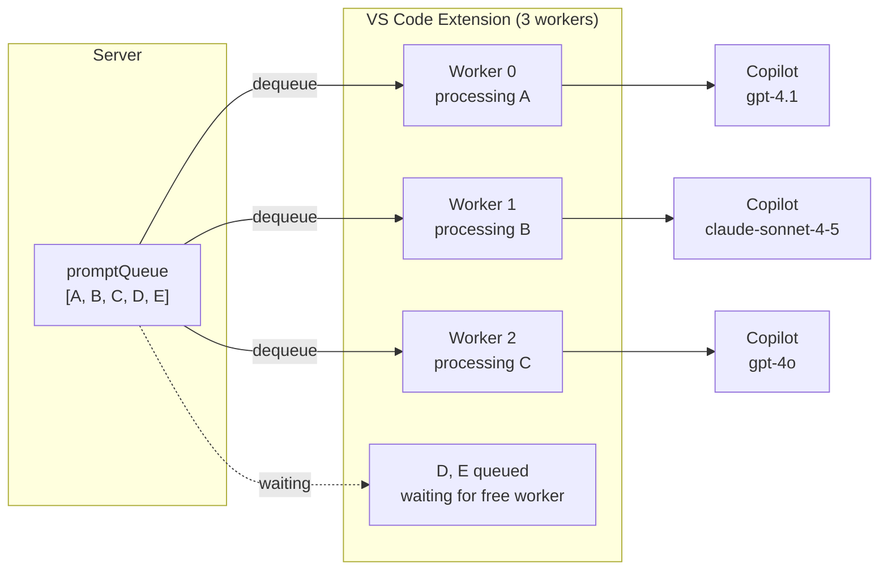
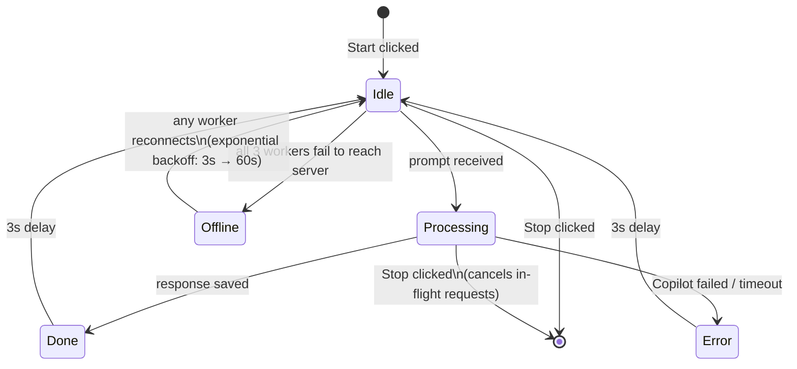

# AI Runner — Architecture Diagrams

## 1. VS Code Extension — Internal Flow

---

## 2. End-to-End System — Server + Extension Interaction

---

## 3. Parallelism Model

---

## 4. Reconnection & Offline Detection

