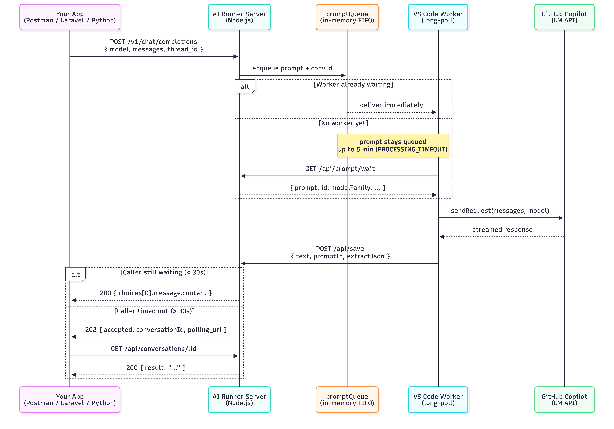
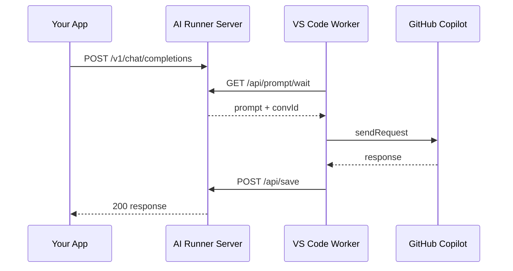
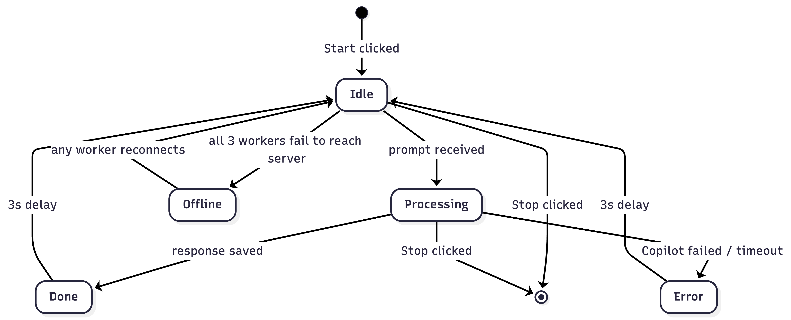
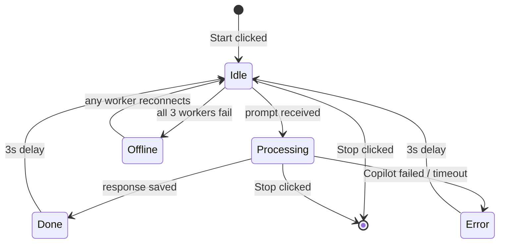
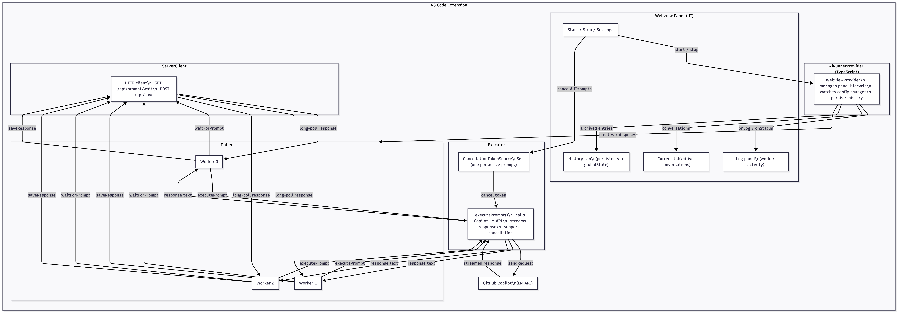
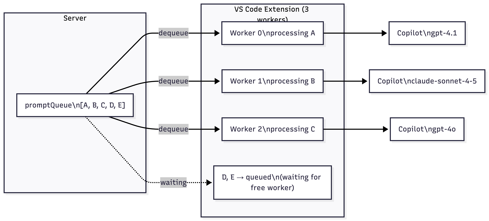

# AI Runner — VS Code Extension

Polls an **AI Runner Server** for prompts, executes them via the **GitHub Copilot Language Model API** inside VS Code, and returns the results back to the server. Enables any external application to use GitHub Copilot without exposing API keys or model access directly.

## Architecture

The extension acts as a bridge: it continuously polls the server for pending prompts, executes them through Copilot, and posts the response back. No prompts are stored in the extension — everything passes through the server.





---

## Requirements

- **VS Code** 1.90+
- **GitHub Copilot** active subscription (signed in to GitHub in VS Code)
- **AI Runner Server** running and reachable — **[aiextension-server →](https://github.com/lordmacu/aiextension-server)**

---

## Installation

### From source

```bash
git clone https://github.com/lordmacu/vscode-ai-extension.git
cd vscode-ai-extension
npm install
npm run compile
npx vsce package --no-dependencies
code --install-extension vscode-ai-extension-1.0.0.vsix
```

Reload VS Code (`Cmd+Shift+P` → `Developer: Reload Window`).

---

## Configuration

Open VS Code Settings (`Cmd+,`) and search for `aiRunner`, or click the **⚙** button in the AI Runner panel header.

| Setting | Description | Default |
|---------|-------------|---------|
| `aiRunner.serverUrl` | Base URL of the AI Runner Server | *(required)* |
| `aiRunner.apiKey` | API key sent as `X-Api-Key` header | *(required)* |
| `aiRunner.timeoutSeconds` | Max seconds to wait for a Copilot response | `120` |

> **Note:** Both `serverUrl` and `apiKey` must be set before the Start button becomes available.

---

## Usage

1. Set `serverUrl` and `apiKey` in Settings
2. Click **▶ Start** in the AI Runner sidebar panel
3. The extension launches **3 parallel long-polling workers**
4. Workers wait for prompts, execute them via Copilot, and post responses back automatically
5. Click **⏹ Stop** to halt all workers (cancels any in-progress Copilot requests immediately)

---

## Panel Features

### Current tab
Shows active conversations as collapsible cards. Each card displays:
- Conversation ID, timestamp, and model used
- Prompt text with animated pending indicator while waiting for Copilot
- Response with elapsed time once complete
- Copy button (⧉) on each bubble — hover to reveal

### History tab
Persists completed conversations across VS Code restarts (up to 100 entries via `globalState`). Each entry shows:
- Timestamp and model
- First prompt as preview
- Exchange count
- **⧉ Copy conversation** button — copies the full conversation as formatted text
- Expandable to read all prompt/response pairs with elapsed time

### Log panel
Collapsible panel showing worker activity in real time:
- `W0 → [gpt-4.1] [conv-id] prompt text...` — prompt received
- `W0 ← [conv-id] OK 512c 1234ms` — response sent (chars + elapsed)
- Error lines in red with a dot indicator when panel is collapsed

### Status badge
| Badge | Meaning |
|-------|---------|
| `Idle` | Workers running, waiting for prompts |
| `Processing` | At least one prompt being executed |
| `Done` | Last prompt completed successfully |
| `Error` | Last prompt failed |
| `Offline` | All workers lost connection to server |

The **Offline** badge appears when all 3 workers fail to reach the server. Workers retry with exponential backoff (3s → 6s → 12s → … → 60s) and recover automatically.





---

## How It Works



### Long-polling

Each worker calls `GET /api/prompt/wait`. The server holds the connection open (up to 30s) until a prompt is available, then responds immediately. This delivers prompts with near-zero latency without constant request overhead.

```
Worker 0: GET /api/prompt/wait ──► server holds 30s ──► { prompt: "...", id: "conv-1" }
Worker 1: GET /api/prompt/wait ──► server holds 30s ──► { prompt: "", id: null }  (timeout, retry)
Worker 2: GET /api/prompt/wait ──► server holds 30s ──► { prompt: "...", id: "conv-2" }
```



### Conversation Threading

Prompts with the same `id` (or `thread_id` in the OpenAI-compatible API) are grouped as one conversation. The Copilot LM API maintains message history per thread, enabling multi-turn conversations. Set `newChat: true` to reset the history for a thread.

### Cancellation

`Stop` calls `cancelAllPrompts()` which cancels every active `CancellationTokenSource`. In-flight Copilot streaming requests are interrupted immediately — no waiting for the current response to finish.

### Deduplication

If two workers receive the same `conversationId` (should not happen in practice), the second one is discarded via an in-memory `activeConvIds` set.

---

## Server Interaction

The extension only uses two server endpoints:

| Method | Endpoint | Description |
|--------|----------|-------------|
| `GET` | `/api/prompt/wait` | Long-poll — returns next queued prompt or `{ prompt: "" }` on timeout |
| `POST` | `/api/save` | Submit the completed response back to the server |

### Prompt payload (`GET /api/prompt/wait` response)

```json
{
  "prompt": "Analyze this code...",
  "id": "conv-abc123",
  "newChat": false,
  "modelFamily": "gpt-4.1",
  "extractJson": false,
  "justification": "optional justification string",
  "modelOptions": null,
  "systemPrompt": null,
  "maxInputTokens": null
}
```

### Save payload (`POST /api/save` body)

```json
{
  "text": "Here is my analysis...",
  "prompt": "Analyze this code...",
  "promptId": "conv-abc123",
  "extractJson": false
}
```

For full server API documentation (OpenAI-compatible endpoint, admin routes, Docker setup), see the **[AI Runner Server →](https://github.com/lordmacu/aiextension-server)**.

---

## Troubleshooting

**Start button is disabled**
`aiRunner.serverUrl` is not configured. Both `serverUrl` and `apiKey` must be set before the Start button becomes available. Click ⚙ in the panel header to open Settings directly.

**Badge stays "Offline"**
The server is unreachable. Check that the server is running and the URL is correct. Workers retry automatically — no need to stop and restart.

**"No models available" error in logs**
GitHub Copilot is not active. Ensure you have an active Copilot subscription and are signed in to GitHub in VS Code.

**Prompts queue up but nothing happens**
Open the Log panel for details. Common causes: Copilot rate limits, wrong API key (401 from server), or the server URL points to a wrong path.

**Multiple VS Code instances**
Each instance runs its own set of 3 workers independently. If multiple instances are started against the same server, they will compete for prompts — only one worker (across all instances) processes each prompt. Run only one active instance per server endpoint.
